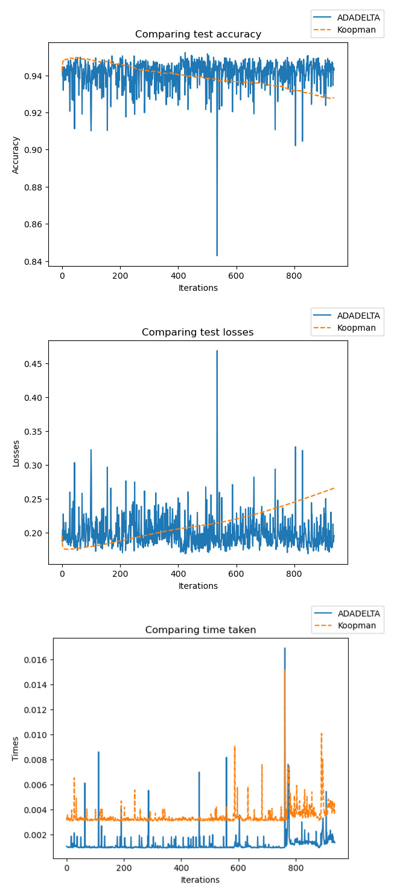
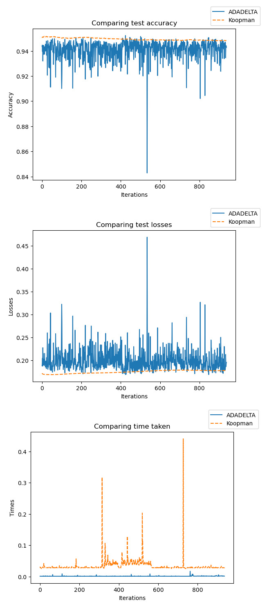
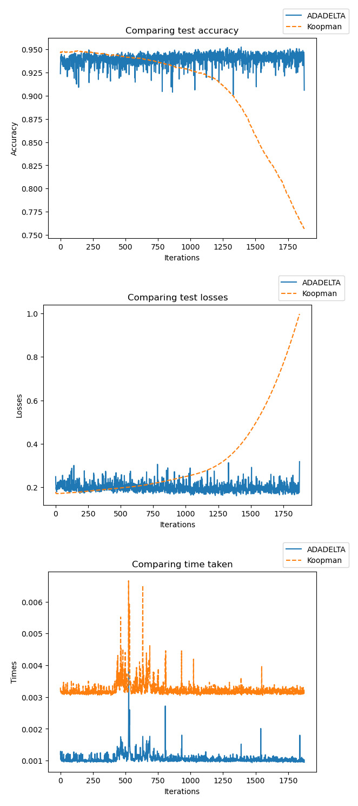
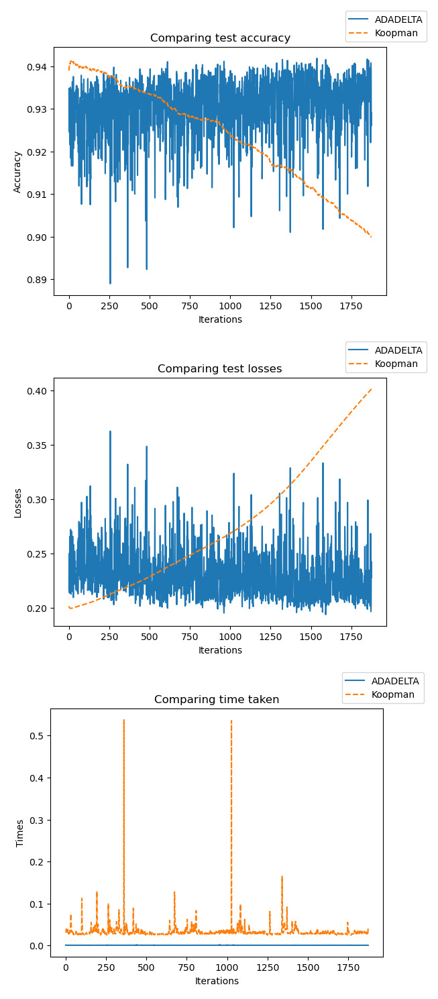

# Koopman Operator for Neural Network Training

TLDR: This repository is an attempt to understand concepts and develop a `jax` based implementation of Koopman operator for Neural Network Optimization, an alternative to purely gradient based optimization.

## Abstract

Optimization of neural network parameters can be visualized as a dynamical system in a discrete temporal domain. The Koopman operator is a powerful tool in the study of dynamical systems, with a recent resurgence in data-driven Koopman operator theory. It allows for linear dynamics in infinite dimensions that is equivalent to the non-linear dynamics in the finite state space. In this report we will explore the work of [Dogra et al](https://proceedings.neurips.cc/paper_files/paper/2020/file/169806bb68ccbf5e6f96ddc60c40a044-Paper.pdf), which applies Koopman operator theory in neural network optimization. We will lay the theoretical groundwork, implement their method and discuss the validity of this method using `jax`.

## Neural network optimization is a dynamical system

The gradient descent algorithm is given as:
$$\theta_{n+1} = \theta_n - \eta\nabla_{\theta} f$$
Where, $\theta_n$ \& $\theta_{n+1}$ are the states of the neural network weights during the $n$th and $n+1$th iteration. $\eta$ is the learning rate and $\nabla_{\theta} f$ is the gradient of the loss function $f$. We can rearrange the terms as follow:

$$\frac{\theta_{n+1} - \theta_n}{\eta} = -\nabla_{\theta} f$$
Considering $\eta \rightarrow 0$ and $n \rightarrow \infty$, it is not difficult to see this equation is analogous to a dynamical system of the following form.
$$\lim_{{\delta t} \to 0}  \frac{\theta_{t+\delta t} - \theta_t}{\delta t} = -\nabla_{\theta} f$$
$$\dot{\theta} = -\nabla_{\theta} f$$

We can make the following observations:
- Neural network optimization is analogous to a dynamical system with weights $\theta \in \Theta$ describing the state of the system.
- The loss function induces a potential energy field in the domain of weights. This is a scalar field, and the weights where the minimum of this field lies, are the desired optima.
- This field exerts a force with magnitude proportional to the magnitude of gradient of the field in the direction opposite to the gradient at any point.
- Following this gradient with appropriate dynamics `may' allow the weights to reach the required optima autonomously.

## Understanding stochastic gradient descent and momentum, using dynamical systems

Additional Notes: [Check](https://github.com/AbhinavRao23/visual_momentum) this out, for a visual guide.

Stochastic gradient descent and mini-batch gradient descent are effective in getting out of inflections and shallow minimums and are also more robust against the initial state choice. They achieve this by sampling the data points on which loss is calculated each iteration. This can be visualized in the dynamical system view, by imagining a stochastic field of potential energy, since the loss term changes a bit each iteration. The loss field is a random field because the data originates from the same distribution. Consider the general case of a mini-batch gradient descent of the form:

$$\theta_{n+1} = \theta_n - \eta\nabla_{\theta} f (X_{i:i+m})$$

Where, $i$ is essentially dependent on $n$, since the data changes each iteration. This is equivalent to a stochastic dynamical system of the form:

$$\dot{\theta} = -\nabla_{\theta} f(X(t))$$

Momentum on the other hand improves the optimization efficacy by changing the dynamics altogether. It achieves this by making the acceleration proportional to the force exerted by the field, unlike gradient descent which relies on velocity being proportional to the force. This modification results in `inertia', i.e. the velocity does not become zero the moment the force (gradient) becomes zero. This inertia allows the optimizer to escape inflections and shallow minimas. Consider the following dynamical system, where the acceleration is proportional to the net force which includes the force exerted by the potential energy field and a drag force against the movement:

$$\ddot{\theta} = - \nabla f - \gamma \dot{\theta}$$

This can be written as a ODE in the standard form using a new variable for velocity

$$
\dot{\theta} = v
$$
$$
\dot{v} = - \nabla f - \gamma v
$$
This can be shown to be equivalent to the equations of gradient descent with momentum:
$$
\theta_{n+1} = \theta_n + v_{n+1}
$$
$$
v_{n+1} = \beta v_n - \alpha \nabla_{\theta} f
$$

## The Koopman Operator Theory

The Koopman operator theory involves defining observables, which are functions of the state, and then identifying the dynamics of these observables in their infinite dimensional function space. Under some constraints, these observables follow linear dynamics which can be described a linear operator colloquially called the Koopman operator. In this section we follow the description of the original paper and describe the Koopman operator treatment for a discrete time dynamical system. 

Consider a $m$ dimensional state vector $\bf{x}$, such that some discrete dynamical system $(\mathcal{M}, t, T )$ be parameterized by the state space variables $\bf{x} = [x_1, x_2, .., x_m] \  \in \mathcal{M}  \subset \mathbf{R}^m$, where the evolution of $\bf{x}$ over discrete time $t \in Z$ is governed by the dynamical map $T : \mathcal{M} \rightarrow \mathcal{M}$. With this we can say:
$$
\bf{x}(t + 1) = T (\bf{x}(t))
$$
The authors assume the systems under study are autonomous (T is not explicitly dependent on t). Now let $g : \mathcal{M} \rightarrow \mathbf{C}$ be the observable of interest. Here, we assume that $g \in \mathcal{F} = \mathcal{L}^2(\mathcal{M}, \sigma)$, where $\sigma$ is a positive single value function that acts as the measure for the functional space. The Koopman operator is defined to be the object $K : \mathcal{F} \rightarrow \mathcal{F}$ that supplies the following action for $g$,
$$
Kg(\bf{x}) = g \cdot T(\bf{x})
$$
$K$ is an object that lifts the dynamics from the original, possibly nonlinear, dynamical system $(\mathcal{M}, t, T )$ to a new, certainly linear, dynamical system $(\mathcal{F}, t, K )$. This can be then extended to multiple observables $\bf{g} = [g_1, g_2, ..., g_k]$. 
$$
K\bf{g}(\bf{x}) = \bf{g} \cdot T(\bf{x})
$$
As we know, linear dynamics are a solved domain in dynamical systems, but it is important to note that $K$ is an infinite dimensional operator. 

## Tying it all together

The authors make 3 choices towards the implementation of the given idea.

 - **The choice of observables:**
The authors choose the identity function $\mathbf{I}$ as choice of observable for the Koopman treatment. This allows directly evaluating the dynamics of the weights, since the dynamics of the observables are the dynamics of the state. $^{\dagger}$ 

- **Choice of Koopman operator approximation method:**
To approximate the Koopman operator, the authors use the finite section method, which uses two shifted matrix of all collected observables, essentially DMD.

- **Computational compromise:**
The theoretically coherent thing to do would be to record every weight of the neural network as a column of the matrix, and subsequently apply the finite section method on them. The authors posit the computational complexity of this might be be intractable due to the size of the neural network and thus provide a spectrum of sub-optimal approximation. This spectrum spans building the matrix (a scalar) for each weight, for each node, for each layer or for the entire network (the right thing to do). The authors use node-wise dynamics justifying it with the trade-off against computational complexity. Here a node, refers to all the weights from a layer $i$ used for a single activation in layer $i+1$.

$\dagger$: We note here, that the authors actually use the projection function $\pi_i(\bf{x}) = x_i$ as the observable, and use all the projection functions ($\pi_1, \pi_2, ... \pi_m$) to build the observable list, since the identity observable $\bf{I}(\bf{w}) = \bf{w}$, as defined in the paper, that returns the state vector does not satisfy the $\mathcal{L}^2$ requirement of the observable.

## Results:

We test the method on training a simple feedforward MNIST classfier. The results do not match the results of that of the authors. 

For 1 epoch comparison of ADADelta against Node-wise Koopman and Layer-wise Koopman respectively:

Figure 1: Nodewise Koopman vs ADADelta for 1 epoch

Figure 2: Layerwise Koopman vs ADADelta for 1 epoch

For 2 epoch comparison of ADADelta against Node-wise Koopman and Layer-wise Koopman respectively:

Figure 3: Nodewise Koopman vs ADADelta for 2 epochs

Figure 4: Layerwise Koopman vs ADADelta for 2 epochs